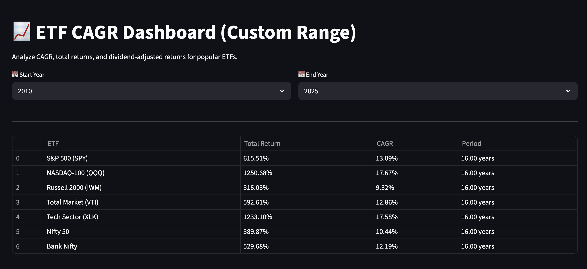

# 📈 ETF CAGR Dashboard

A comprehensive Streamlit web application for analyzing and comparing the Compound Annual Growth Rate (CAGR) and total returns of popular ETFs and market indices across custom time periods.

## 🚀 Features

- **Interactive Time Period Selection**: Choose any start and end year from 1950 to present
- **Multi-Market Analysis**: Compare US ETFs with Indian market indices
- **Clean Table View**: All performance metrics displayed in an easy-to-compare table format
- **Real-time Data**: Fetches live market data using Yahoo Finance API
- **Comprehensive Metrics**: Shows Total Return, CAGR, and investment period for each fund

## 📊 Supported ETFs & Indices

### US Market ETFs
- **S&P 500 (SPY)** - Tracks the S&P 500 index
- **NASDAQ-100 (QQQ)** - Tracks the top 100 non-financial NASDAQ companies
- **Russell 2000 (IWM)** - Small-cap US stocks
- **Total Market (VTI)** - Entire US stock market
- **Tech Sector (XLK)** - Technology sector focus

### Indian Market Indices
- **Nifty 50** - India's benchmark index of top 50 companies
- **Bank Nifty** - Indian banking sector index

## 🖼️ Dashboard Preview



*Example showing performance comparison from 2010-2025, highlighting the strong performance of tech-focused funds and competitive returns from Indian banking sector.*

## 🛠️ Installation & Setup

### Prerequisites
- Python 3.7 or higher
- pip package manager

### Installation Steps

1. **Clone or download the project**
   ```bash
   cd CAGR_stocks
   ```

2. **Create a virtual environment**
   ```bash
   python -m venv venv_CAGR
   ```

3. **Activate the virtual environment**
   ```bash
   # On macOS/Linux
   source venv_CAGR/bin/activate
   
   # On Windows
   venv_CAGR\Scripts\activate
   ```

4. **Install required packages**
   ```bash
   pip install -r requirements.txt
   ```

5. **Run the application**
   ```bash
   streamlit run app.py
   ```

6. **Access the dashboard**
   - Open your browser and go to `http://localhost:8501`

## 📦 Dependencies

```
streamlit
yfinance
pandas
```

## 🎯 How to Use

1. **Select Time Period**: Use the dropdown menus to choose your start and end years
2. **View Results**: The table automatically updates with performance metrics for all ETFs/indices
3. **Compare Performance**: Easily compare Total Return, CAGR, and investment periods across different funds
4. **Analyze Trends**: Identify top-performing sectors and markets over your selected timeframe

## 📈 Key Metrics Explained

- **Total Return**: The overall percentage gain/loss over the entire period
- **CAGR (Compound Annual Growth Rate)**: The annualized return rate, showing consistent yearly growth
- **Period**: The exact number of years for the analysis

## 🔍 Sample Analysis Insights

Based on the 2010-2025 period shown in the screenshot:

- **Tech dominance**: NASDAQ-100 (QQQ) and Tech Sector (XLK) showed exceptional performance with ~17.6% CAGR
- **Indian banking strength**: Bank Nifty delivered competitive 12.19% CAGR, outperforming broader Indian market
- **Market comparison**: US tech-focused funds outperformed both US broad market and Indian indices during this period

## 🚨 Important Notes

- **Data Availability**: Historical data depends on when each ETF/index was launched (most ETFs started in the 1990s-2000s)
- **Real-time Updates**: Data is fetched live from Yahoo Finance, so results reflect current market conditions
- **Currency Considerations**: US ETFs are in USD, Indian indices in INR - consider currency fluctuations for international comparisons

## 🤝 Contributing

Feel free to submit issues, feature requests, or pull requests to improve the dashboard.

## 📄 License

This project is open source and available under the MIT License.

---

**Built with ❤️ using Streamlit and Yahoo Finance API**
